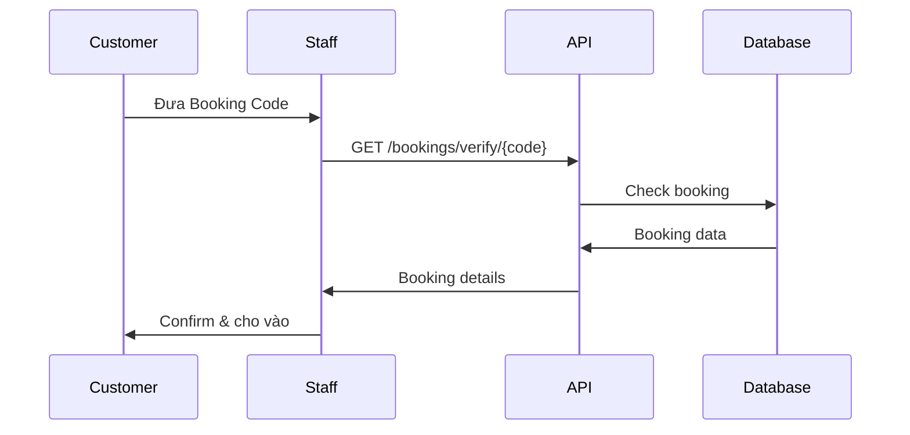

# 📚 Movie88 - Admin & Staff Documentation

## 📋 Mục lục

1. [Giới thiệu](#giới-thiệu)
2. [Phân quyền hệ thống](#phân-quyền-hệ-thống)
3. [API Endpoints cho Admin/Staff](#api-endpoints-cho-adminstaff)
4. [Hướng dẫn sử dụng](#hướng-dẫn-sử-dụng)

---

## 🎯 Giới thiệu

Tài liệu này dành cho **Admin** và **Staff** của hệ thống Movie88. 

### Mục đích
- Quản lý hệ thống đặt vé xem phim
- Xác thực booking tại quầy (Staff)
- Quản trị toàn bộ dữ liệu (Admin)

### Tech Stack
- **Backend**: ASP.NET Core 8.0
- **Database**: PostgreSQL (Supabase)
- **Authentication**: JWT Bearer Token
- **API Documentation**: Swagger UI

---

## 👥 Phân quyền hệ thống

### 🔵 Customer (Khách hàng)
**Quyền hạn:**
- ✅ Xem danh sách phim
- ✅ Đặt vé xem phim
- ✅ Xem lịch sử booking
- ✅ Review phim
- ✅ Xem profile cá nhân
- ❌ KHÔNG có quyền admin/staff

**Không cần tài liệu này**

### 🟢 Staff (Nhân viên)
**Quyền hạn:**
- ✅ Xác thực booking code tại quầy
- ✅ Xem thông tin booking
- ✅ Check-in khách hàng
- ❌ KHÔNG sửa/xóa dữ liệu

**Use Cases:**
1. Khách hàng đến quầy với **Booking Code**
2. Staff nhập booking code để verify
3. Kiểm tra thông tin: tên phim, suất chiếu, số ghế
4. Xác nhận và cho khách vào xem phim

### 🔴 Admin (Quản trị viên)
**Quyền hạn:**
- ✅ **TẤT CẢ** quyền của Staff
- ✅ Quản lý phim (thêm/sửa/xóa)
- ✅ Quản lý rạp chiếu
- ✅ Quản lý suất chiếu
- ✅ Quản lý users
- ✅ Xem báo cáo thống kê
- ✅ Quản lý khuyến mãi/voucher

---

## 🔐 API Endpoints cho Admin/Staff

### Base URL
- **Production**: `https://movie88aspnet-app.up.railway.app/api`
- **Swagger UI**: `https://movie88aspnet-app.up.railway.app/swagger`

### 📌 Authentication (Đăng nhập)

#### 1. Login
```http
POST /api/auth/login
Content-Type: application/json

{
  "email": "admin@movie88.com",
  "password": "Admin@123"
}
```

**Response Success:**
```json
{
  "success": true,
  "statusCode": 200,
  "message": "Login successful",
  "data": {
    "accessToken": "eyJhbGciOiJIUzI1NiIsInR5cCI6IkpXVCJ9...",
    "refreshToken": "b5d0c8e2-4f3a-...",
    "email": "admin@movie88.com",
    "fullname": "Admin User",
    "role": "Admin"
  }
}
```

**⚠️ Lưu `accessToken` để dùng cho các request tiếp theo!**

---

## 🎟 Staff: Xác thực Booking Code

### Use Case: Khách đến quầy với Booking Code

Staff cần verify booking trước khi cho khách vào xem phim.

### ⚠️ API Hiện tại chưa có

**Endpoint cần implement:**
```http
GET /api/bookings/verify/{bookingCode}
Authorization: Bearer {staff_token}
```

**Response mong muốn:**
```json
{
  "success": true,
  "data": {
    "bookingCode": "BK20251104001",
    "status": "Confirmed",
    "customer": {
      "fullname": "Nguyen Van A",
      "email": "nguyenvana@example.com",
      "phone": "0901234567"
    },
    "movie": {
      "title": "Avengers: Endgame",
      "posterUrl": "https://..."
    },
    "showtime": {
      "startTime": "2025-11-04T19:30:00",
      "cinema": "CGV Vincom Center",
      "auditorium": "Cinema 3",
      "format": "2D",
      "language": "Phụ đề"
    },
    "seats": [
      { "row": "A", "number": 5 },
      { "row": "A", "number": 6 }
    ],
    "totalAmount": 200000,
    "paymentStatus": "Completed"
  }
}
```

### Workflow Xác thực



### ✅ Action Items cho Dev Team

**Cần implement endpoint:**
1. `GET /api/bookings/verify/{bookingCode}` - Verify booking code
2. `PUT /api/bookings/{id}/check-in` - Check-in customer
3. `GET /api/bookings/today` - Danh sách booking hôm nay

**Roles có quyền:** Staff, Admin

---

## 🎬 Admin: Quản lý Phim

### ⚠️ Các API sau chưa triển khai

**Cần implement:**

#### 1. Thêm phim mới
```http
POST /api/movies
Authorization: Bearer {admin_token}
Content-Type: application/json

{
  "title": "Avatar 2",
  "description": "...",
  "durationminutes": 192,
  "director": "James Cameron",
  "releasedate": "2025-12-16",
  "country": "USA",
  "rating": "PG-13",
  "genre": "Sci-Fi, Adventure",
  "posterurl": "https://...",
  "trailerurl": "https://..."
}
```

#### 2. Cập nhật phim
```http
PUT /api/movies/{id}
Authorization: Bearer {admin_token}
```

#### 3. Xóa phim
```http
DELETE /api/movies/{id}
Authorization: Bearer {admin_token}
```

**Roles có quyền:** Admin only

---

## 🏢 Admin: Quản lý Rạp & Suất chiếu

### ⚠️ Chưa triển khai

**Cần implement:**

#### 1. Quản lý Cinema
```http
POST /api/cinemas
GET /api/cinemas
PUT /api/cinemas/{id}
DELETE /api/cinemas/{id}
```

#### 2. Quản lý Showtime
```http
POST /api/showtimes
GET /api/showtimes
PUT /api/showtimes/{id}
DELETE /api/showtimes/{id}
```

**Roles có quyền:** Admin only

---

## 📊 Admin: Báo cáo & Thống kê

### ⚠️ Chưa triển khai

**Cần implement:**

```http
GET /api/admin/dashboard/stats
GET /api/admin/reports/revenue/daily
GET /api/admin/reports/revenue/monthly
GET /api/admin/reports/bookings/statistics
GET /api/admin/reports/popular-movies
```

**Response mong muốn:**
```json
{
  "totalRevenue": 150000000,
  "totalBookings": 1250,
  "totalCustomers": 850,
  "popularMovies": [
    {
      "movieId": 1,
      "title": "Avengers",
      "totalBookings": 250,
      "revenue": 35000000
    }
  ]
}
```

**Roles có quyền:** Admin only

---

## 🧪 Testing với Swagger UI

### Bước 1: Mở Swagger UI
```
https://movie88aspnet-app.up.railway.app/swagger
```

### Bước 2: Login
1. Tìm endpoint **POST /api/auth/login**
2. Click "Try it out"
3. Nhập credentials admin/staff
4. Execute và copy `accessToken`

### Bước 3: Authorize
1. Click nút **"Authorize"** (🔓) ở góc phải
2. Paste token vào (KHÔNG cần thêm "Bearer")
3. Click "Authorize"

### Bước 4: Test Endpoints
Giờ có thể test tất cả endpoints có 🔒 icon

---

## 📝 Danh sách Endpoints Đã Triển khai

### ✅ Hoạt động (17 endpoints)

**Authentication:**
- ✅ POST /api/auth/register
- ✅ POST /api/auth/login
- ✅ POST /api/auth/logout
- ✅ POST /api/auth/refresh-token

**Movies:**
- ✅ GET /api/movies (list, pagination, filters)
- ✅ GET /api/movies/{id}
- ✅ GET /api/movies/now-showing
- ✅ GET /api/movies/coming-soon
- ✅ GET /api/movies/search
- ✅ GET /api/movies/{id}/showtimes

**Reviews:**
- ✅ GET /api/reviews/movie/{movieId}
- ✅ POST /api/reviews

**Bookings:**
- ✅ GET /api/bookings/my-bookings

**Promotions:**
- ✅ GET /api/promotions/active

**Customers:**
- ✅ GET /api/customers/profile
- ✅ PUT /api/customers/profile

**System:**
- ✅ GET /health

### ❌ Chưa triển khai (cần ưu tiên cho Admin/Staff)

**Ưu tiên cao (Staff cần):**
1. ❌ GET /api/bookings/verify/{bookingCode} - **CRIT ICAL**
2. ❌ PUT /api/bookings/{id}/check-in
3. ❌ GET /api/bookings/today

**Ưu tiên trung (Admin cần):**
4. ❌ POST /api/movies
5. ❌ PUT /api/movies/{id}
6. ❌ DELETE /api/movies/{id}
7. ❌ GET /api/admin/dashboard/stats

**Ưu tiên thấp (Nice to have):**
- ❌ Cinema management (POST/PUT/DELETE)
- ❌ Showtime management (POST/PUT/DELETE)
- ❌ Reports & Analytics

---

## 🚀 Roadmap

### Phase 1: Staff Functions (Sprint hiện tại)
- [ ] Verify booking code
- [ ] Check-in customer
- [ ] View today's bookings

### Phase 2: Admin Functions (Sprint tiếp)
- [ ] Manage movies (CRUD)
- [ ] Manage showtimes (CRUD)
- [ ] Dashboard overview

### Phase 3: Reports & Analytics (Future)
- [ ] Revenue reports
- [ ] Booking statistics
- [ ] Popular movies

---

## 📞 Liên hệ

**Development Team:**
- Backend Lead: [Your Name]
- Database: PostgreSQL (Supabase)
- Deployment: Railway.app

**Production URLs:**
- API: https://movie88aspnet-app.up.railway.app/api
- Swagger: https://movie88aspnet-app.up.railway.app/swagger
- GitHub: https://github.com/Zun1702/Movie88.aspnet

---

**Last Updated**: November 4, 2025  
**Version**: 1.0  
**Status**: Active Development
